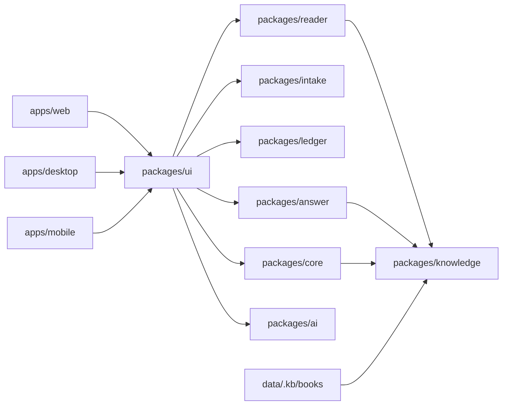

# 系统架构



## 关键边界

`packages/core` 只负责历法、盘面事实与规则命中。输入相同且配置快照相同，输出必须相同；不可读取当前时间、网络或用户数据库。

`packages/answer` 把事实、规则、应期和证据装配为可读结果，并执行安全降级。AI 内容始终作为 E 级外部解释展示，不能伪装成引擎结论。

`packages/knowledge` 管理书目、术语、异体字和检索。原文保留，检索使用派生的 `normalized_text`；任何自动修复都必须可重放，并保留无法恢复的缺字符号。

`packages/ui` 通过共享状态容器连接各域包。持久化配置使用默认值递归合并，旧版本缺少的新字段会自动补全；解析失败或存储不可用时回退到默认配置。

## Web 启动与分包

入口先显示静态载入状态，再异步加载 86 部语料。每本书独立成 chunk，避免把 30MB 以上语料塞进单个主包。React、排盘引擎和界面分别拆包，首屏脚本不等待浏览器解析全部古籍。

## 引文链

```text
规则命中 ruleId
  -> CitationRef（书、章、segId、证据等级）
  -> Reader 定位（segId -> 章节 -> 引文文本 -> 未找到）
  -> 原文高亮与来源元数据
```

